   

  
  

  <h1>Agent 2B - AI in your Flash Drive</h1>
  
  

  

## Try it

You need Windows 10/11 and an NVIDIA GPU (an RTX 5060 or better) whose driver supports CUDA 12.4 or later (`nvidia-smi` shows the version).
CUDA itself doesn't need to be installed.

1. **Double-click `install`.** It downloads about 13 GB into `runtime/`: portable Git Bash, Node.js, llama.cpp (CUDA
   build) and the gpt-oss-20b model. Run it again any time: it fetches only what's missing, and an interrupted
   download resumes. It uses the Windows proxy setting if one is on.
2. **Double-click `app`.** A terminal opens in your home folder with 2B running. `/exit` leaves a normal Git Bash
   prompt: `cd` into a project and type `2b` to work there.

The first start loads the model (~30 s). llama.cpp splits it between GPU and CPU to fit whatever VRAM is free at that
moment, so there is nothing to configure per computer. The server stops when the last 2B window closes.

## What it can do

The model works through eleven tools. Anything that changes a file, runs a command or fetches a page asks first
(`y` / `n` / `a` for always); after a `n` you can tell it why.

| Reads, no asking | Asks first |
|---|---|
| Read, Glob, Grep, WebSearch | Edit, Write (shown as a diff), Bash, PowerShell, WebFetch |
| Git, GitHub (`gh`) when read-only | Git, GitHub when they change something |

It reads the project's `AGENTS.md` or `CLAUDE.md`, streams its reasoning dimmed, and renders answers as markdown.
In the agent: `/clear` starts over, `/effort low|medium|high` sets reasoning effort, `/tokens` shows context used
(64k total), `/prompt` shows the exact text the model reads, `/exit` quits.

**Know the limits:** it's a 20B model (about 3.6B active per token). It's good at small, scoped tasks in a codebase
or on the machine; give it tight tasks rather than open-ended ones.

## Change it

The agent is plain TypeScript run directly by Node: no build step, no npm packages. Everything the model reads is a
text file in [`agent/prompt/`](agent/prompt/), and each tool is one file in [`agent/tools/`](agent/tools/).
[`agent/README.md`](agent/README.md) covers running a change, adding a tool, upgrading a component and swapping the
model.

## License

[Apache 2.0](LICENSE)
